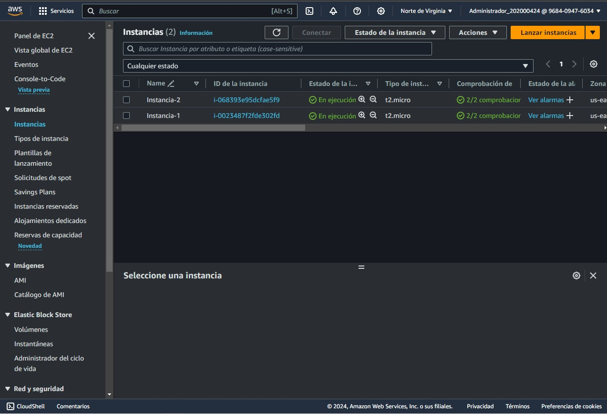

# Manual de Configuracion

## Grupo 12

| Nombre           | Carnet       |
|:----------------:|:------------:|
|Kemel Efrain Josue Ruano Jeronimo | 202006373 |
|Jonatan Leonel Garcia Arana | 202000424 |

## Configuraciones realizadas

### Arquitectura Utilizada

    <strong> Aplicación Web en la Nube: </strong> Combina frontend interactivo, backend/API y almacenamiento de datos en la nube para ofrecer aplicaciones escalables y seguras, desplegada en plataformas como AWS.

### Usuarios IAM Utilizados

Usuario RDS y Politicas 
* Este usuario es que tiene los permisos sobre la RDS

Usuario EC2 y Politicas
* Este Usuario tiene los permisos para las EC2

Usuario S3 y Politicas
* UsuarioS3 ,  este usuario tiene los permisos para el bucket para conectarse y poder ingresar objetos o eliminarlos.

### EC2 Creadas

### Base de datos

### Balanceador

### Bucket de Imagenes

### Aplicacion Web
#### Fronted
* Login y Registro

* Home

#### Backend
Existen dos un hecho en Python y uno en Nodejs
* Seleccione una opcion para ver configuracion
[Python](https://github.com/Jona1056/GRUPO12_PRAC1_SEMI/tree/main/Backend_Python) &nbsp; ,
[Nodejs](https://github.com/Jona1056/GRUPO12_PRAC1_SEMI/tree/main/backend_node)
